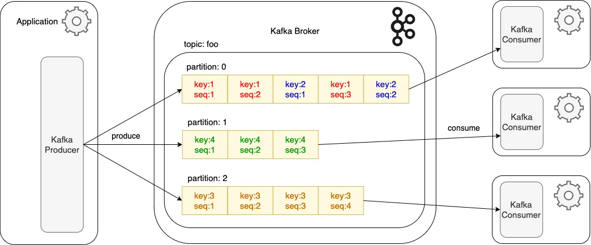

# Apache Kafka Explained: Real-World Use Cases and Practical Insights

## Quick refresher

* **Partition**: A partition is a fundamental unit of parallelism and scalability within a Kafka topic. Each topic in Kafka is divided into one or more partitions to enable parallel processing and Kafka distributes partitions across multiple brokers.
* **Broker**: A broker is a server within the Kafka cluster that handles the storage, processing, and transportation of data. Brokers are responsible for maintaing topic logs, data replication, data durability, and also serving data to consumers
* **In-Sync replicas**: A list of replicas that are fully synchronized with the leader replica for a given partition, spanned across multiple physical servers for fault tolerance. These replcias have all the committed messages that the leader has.
* **Leader replica**: A leader replica is the primary replica for a given partition that handles all the read and write requests. It is the authoritative source for data in that partition and coordinates with the follower replicas to ensure data consistency and fault tolerance.
* **Consumer group**: A consumer group is a collection of consumers that work together to consume messages from one or more partitions. Consumer groups provide a way to achieve parallel data processing and load balacing.
* **Consumer Group Coordinator**: Coordinator manages partition assignments, offset commits, and consumer health. Consumers share partition ownership within a group, and assignments change when consumers join or leave, or when partitions are added.
* **Producer**: A producer is a client application or component that publishes messages to a Kafka topic. Producers send data to Kafka brokers, where it is stored in partitions within the specified topic.

## Key highlights of partitions

1. Messages within a single partition are strictly ordererd
2. Partitions allow Kafka to scale horizontally. Each partition can be placed on different brokers, enabling parallel processing and balacing the load across Kafka cluster
3. Producers can write to multiple partions in parallel, and consumers can read from multiple partions in parallel, enhancing throughput and performance
4. Each partition can have multiple replicas on different brokers to provide fault tolerance. If one broker fails, another broker with the replica can take over.
5. Each message within a partition has a unique offset, which acts as a unique identifier and allows consumers to keep track of their position within the partition.

## Key highlights of consumer groups

1. Each partition in a topic is consumed by exactly one consumer within a consumer group. If you have more partitions than consumers, some consumers will read from multiple partitions.
2. You can increase the numbers of consumers in a consumer group to increase the parallelism and throughput of your application
3. If a consumer in a group fails, Kafka will automatically rebalance the partitons among the remaining ocnsumers to ensure continuous processing.
4. Each consumer group has its own offset for each partition, allowing different consumer groups to consume the same messages independently at their own pace. This is to broadcast information among multiple consumers (downstream applications).

## Typical interaction between partitions and consumer group

1. **Single partition, Single Consumer**: If a topic has only one partition, one consumer in the consumer group can consume from it. (very unlikely scenario)
2. **Single Partition, Multiple Consumer**: If a topic has only one partition, only one consumer in the consumer group can consume from it. It doesn't matter if there are multiple consumers
3. **Multiple Partitions, Single Consumer**: If a topic has multiple partitons but the consumer group has only one consumer, that consumer will consume from all partitions
4. **Multiple Partitions, Multiple Consumers**: Kafka will distribute the partitions among the consumers in the group to achieve parallel processing. If there are more consumers than partitions, some consumers will remain idle.

---
Example:
Consider a topic orders with 4 partitions and a consumer group order-processors with 2 consumers:

Consumer 1 might read from partitions orders-0 and orders-1.
Consumer 2 might read from partitions orders-2 and orders-3.
If Consumer 1 fails, Kafka will rebalance the partitions, and Consumer 2 might end up reading from all 4 partitions.

## Concept of rebalancing

[rebalacing](https://miro.medium.com/v2/resize:fit:640/format:webp/1*HBitFLxpQVkk12oMs5lefw.jpeg)

Kafka partitons are assigned to consumers and the assignment gets impacted when a consumer fails, joins the cluster or leaves voluntarily. This process is called rebalacing.

### Rebalance types

1. **Eager Rebalance**: All consumers stop, partitions are reassigned, and consumption resumes after reassignment. This can cause temperorary unavailability.
2. **Cooperative Rebalance**: Only partitions needing reassignment are affected, allowing other partitions to continue without being impacted. This method reduces unavailability and is suitable for large consumer groups.

## How does cooperative rebalance works internally?

Cooperative Rebalancing is designed to allow consumers to give up ownership of their partitions gradually, rather than all at aonce, which minimizes the impact on ongoing consumption. The protocol involves two phases post trigger: revocation and assignment.

**Rebalance Phases:**

* Trigger: Consumers continue to send heartbeats to indicate they are active. If a consumer fails to send heartbeats withing the session timeout, it is considereded dead, and a new rebalance is triggered. Similarly the rebalance gets triggered for new consumer addition.
* Revocation Phase: The group coordinator sends a REVOKE message to consumers, indicatins which subset of partitions (note, it's not all partitions) they should stop consuming. Consumers commit offsets and stop consuming from the revoked partitions.
* Assignment Phase:
  1. The coordinator calculates the new assignments, taking into account the partitons that were just revoked. The coodinator sends SSIGN messages to consumers, indicating their new partition assignments.
  2. Consumers acknowledge the new assignments and begin consuming from their new partitons. This incremental approach continues until all necessary partitons are reassigned.

---

Assignments happens using strategy configured via **partition.assignment.strategy** property. All consumers in a group must use the same strategy

---

## Assignment Strategies

1. **Range Assignor:** This strategy assigns contiguous partitions to consumers, beneficial for co-located partitions but this strategy may leave consumers idle.
2. **Round Robin Assignor:** This strategy distributes partitions evenly among consumers, maximizing consumer utilization but may cause unnecessary partition movements during rebalances.
3. **Sticky Assignor:** This strategy minimizes partition movement, balacing the load and reducing rebalance impact.
4. **Cooperative Sticky Assignor:** This strategy extends Sticky Assignor to support cooperative rebalances, where only necessary partitions are reassigned, minimizing disruption.

It's important to come up with partition count, assignment strategy based on application/business requirement to ensure performance and reliability of the Kafka system.

## Message de-duplication

There are multiple ways we can achieve message de-duplication. To understand the process, we need to understand different Kafka message delivery guarantees. Kafka provides three types of message delivery guarantees to ensure data reliability and consistency: "at-most-once", "at-least-once," and "exactly-once."

[consumer, producer and partition](https://miro.medium.com/v2/resize:fit:640/format:webp/1*-UQKy4HJAsTsJjnHcqrPmg.png)

**1. At Most-Once Delivery:**

* **Definition**: Each message is delivered at most once, meaning there is a possibility that some messages might not be delivered.
* **Charateristics**: If a message delivery fails, Kafka does not attempt to resend it. It is suitable for applications where occasional message loss is acceptable, and low latency is more critical.
* **Configuration**; Set acks=0 in the producer configuration to not wait for acknowlegment from the broker. Disable retries (retries=0) to prevent re-sending messages.

**2. At-Least-Once Delivery:**

* **Definition**: Each message is delivered at least once, meaning messages might be delivered more than once in case of failures.
* **Characteristics**: Kafka retries message delivery in case of failures, ensuring that messages are eventually delivered. Consumers must handle potential duplicate messages. It is suitable for applications where message loss is unacceptable, even if it means dealing with duplicates.
* **Configuration**: Set acks=all in the producer configuration to wait for acknowledgment from all in-sync replicas. Enable retries (retries set to a non-zero value) to ensure message re-delivery on failure. Enable consumer offset commits to ensure that messages are not lost but may be processed more than once.

**3. Exactly-Once Delivery:**

* **Definition**: Each message is delivered exactly once, ensuring no duplicates and no message loss.
* **Characteristics**: Producers ensure that each message is sent exactly once to the broker. Kafka uses transactions to group a set of messages and commit them atomatically.
* **Configuration**: Enable idempotence in the producer (enable.idempotence=true). Use transactions in the producer for atomic writes.

Retrying to send a failed message often includees a small risk that both messages were successfully written to the broker, leading to duplicates. This can happen as illustrated below.

1. Kafka producer sends a message to Kafka
2. The message was successfully written and replicated.
3. Network issues prevented the broker acknowledgment from reaching the producer.
4. The producer will treat the lack of acknowledgment as a temporary network issue and will retry sending the message (since it can't know that it was received).

In that case, the broker will end up having the same message twice.

### How producer idempotence works

Producer idempotence ensures that duplicates are not introduced due to unexpected retries.

When enable.idempotence is set to true, each producer gets assigned a Producer Id (PID) and the PID is included every time a producer sends messages to a broker. Additionally, each message gets a monotonically increasing sequence number (different from the offset, used only for protocol purposes). A separate sequence is maintained for each topic partition that a producer sends messages to. On the broker side, on a per partition basis, it keeps track of the largest PID-Sequence Number combination that is successfully written. When a lower sequence number is received, it is discarded.

### Consumer idempotence

* **Idempotent Operations**: These are operations that can be applied multiple times. For instance, setting a value in a database to a specifc number is idempotent, while incrementing a value is not.
* **Exactly Once Semantics (EOS):** While Kafka producers can be configured to ensure exactly once semantics (guaranteeing each message is delivered exactly once), consumers typically aim for at-least-once delivery. Implementing idempotence at the consumer side ensures that even if a message is processed more than once, it doesn't lead to incorrect results.

## Strategies for Implementing Idempotent Consumers

* **Message IDs:** Use unique message IDs to track processed message. Store these IDs in a database or a cache. Before processing a message, check if its ID has already been processed.
* **Offset Tracking:** Track offsets of processed messages. Ensure that messages with the same offset are not processed more than once.
* **Database Transactions:** Use transactions in database to ensure that operations are atomic and consistent. If a message leads to multiple database operations, wrap them in a single transaction. Please note Kafka doesn't support XA transaction.
* **Kafka Transactions:** Use Kafka's transactional APIs to produce and consume messages in a transactional manner. This ensures that messages are consumed and prodced exactly once, even in the presence of failures.

---

In an essence we need to ensure our processing logic is capable of handling duplicate messages and the state of the message object in durable store is not altered.

---

## Message ordering

If ordering is important, first thing we need to evaluate is if Kafka is a right choice. If we are sticking to Kafka we will need to leverage the idea that message ordering is ensured in individual partitions of a topic.

1. **One Partition:** If we have only one partiton the ordering is always ensured. Not a practical solution for a high volume production application.
2. **One consumer:** If we have only one consumer we can apply business logic in consumer to maintain the ordering. not a practical solution for a hight volume production application.
3. **Key based partition assignment:** Use a consistent hashing strategy based on message keys to assign messages to partitions. Messages with the same key will always be sent to the same partition, preserving the order for that key. It works seamlessly till we perform re-partitioning so it's not an ideal solution for applications where frequent repartitioning happens.
4. **Compacted topic:** A compacted topic is designed to retain only the latest value for each unique key within the topic. Unlike topics, which retain all messages for a specified retention period, a compacted topic continuosly removes older update for each key is kept. It is useful for business applications that have requirement to track only the latest status. This can be done by setting **cleanup.policy=compact**.

[full blog](https://medium.com/p/fba71c042ace)
